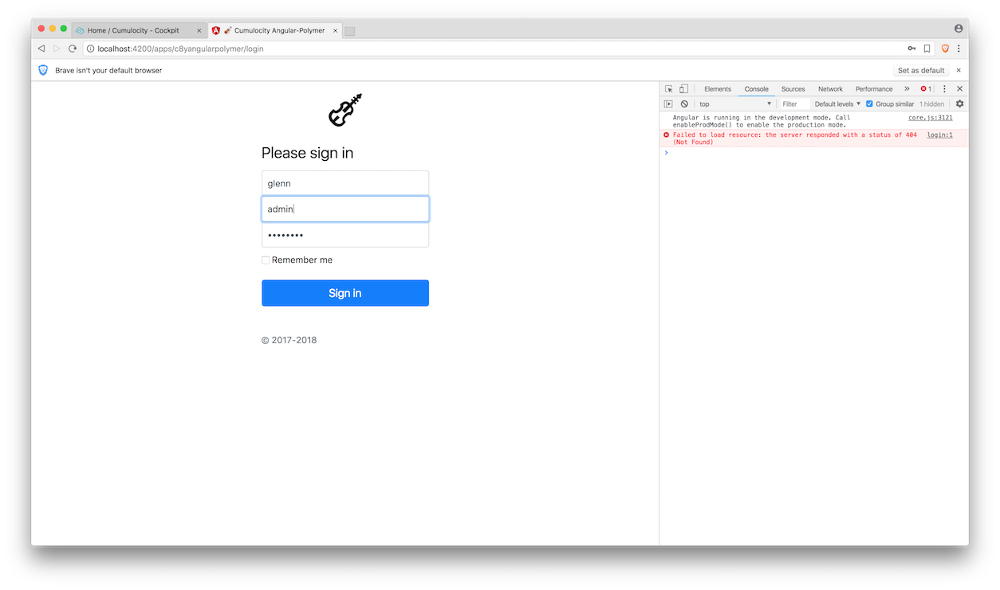
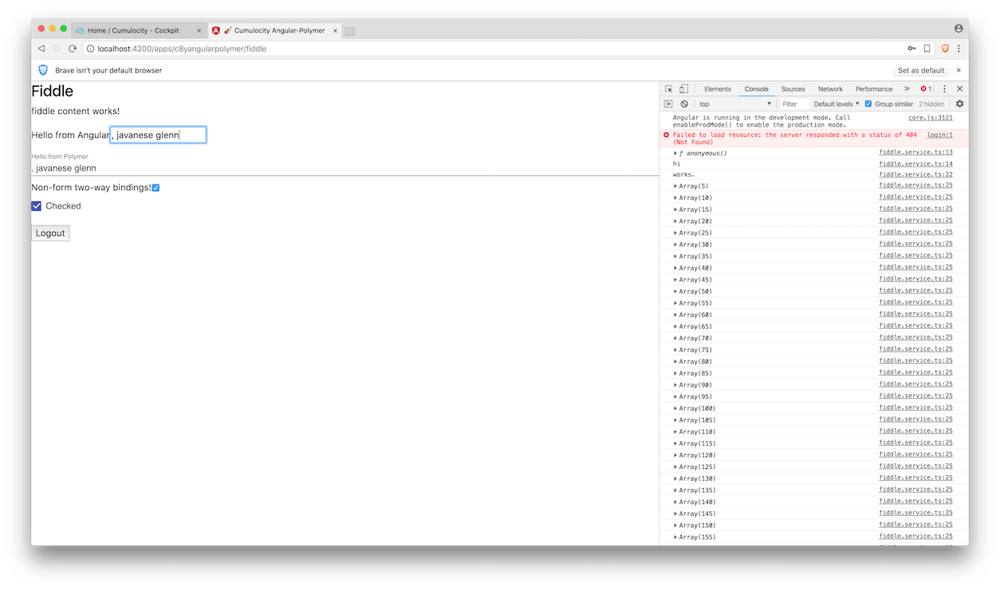

# c8y-angular-polymer-boilerplate

Cumulocity + Angular + Polymer (Web Components) boilerplate UI fiddle project. 

This project was generated with [Angular CLI](https://github.com/angular/angular-cli) version 6.1.2.

### Why?
Make it easy to show the usage and/or fiddle around our newly-developing Angular 6+ data services and components as well as our framework-agnostic JS client lib. This also provides a free-playground to #rideWithTheHype of [Angular + #webComponents, #polymer, and #useThePlatform](https://github.com/hotforfeature/origami).

## Development server
- Adapt the app context path of yours in `angular.json` (default to `c8yangularpolymer` \[sic.\]).

- Configure the proxy target of REST API server in `proxy.conf.json`: change the target from `https://glenn.cumulocity.com` to your own Cumulocity tenant URL. 

- Run `ng serve` for a dev server. Navigate to `http://localhost:4200/apps/{{app_context_path}}/`. The app will automatically reload if you change any of the source files.

## Code scaffolding
Run `ng generate component component-name` to generate a new component. You can also use `ng generate directive|pipe|service|class|guard|interface|enum|module`.

## Build
- Run `ng build` to build the project. The build artifacts will be stored in the `dist/` directory. 
<!--Use the `--prod` flag for a production build.-->
 
- Zip the contents under the `c8y-angular-polymer-boilerplate` directory without the enclosing directory itself. Note that the name of the ZIP archive has to be aligned with the app context path specified in `index.html` and `proxy.conf.json` (default to `c8yangularpolymer`).

## Running unit tests
Run `yarn test` to execute the unit tests via [Jest](https://jestjs.io/en/).

## Running end-to-end tests
Run `ng e2e` to execute the end-to-end tests via [Protractor](http://www.protractortest.org/).

## Author
Glenn Dwiyatcita ([@dwiyatci](http://tiny.cc/dwiyatci))

## License
MIT.

<!--## Further help-->
<!--To get more help on the Angular CLI use `ng help` or go check out the [Angular CLI README](https://github.com/angular/angular-cli/blob/master/README.md).-->
